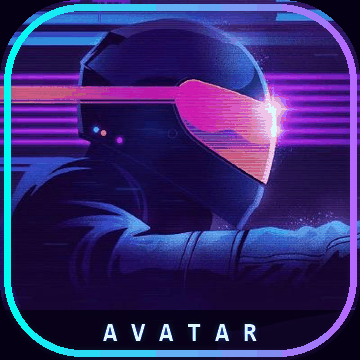
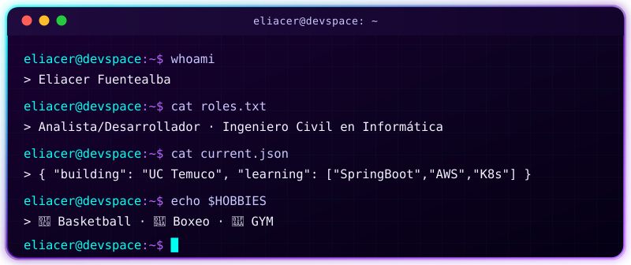
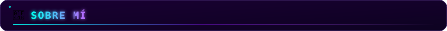
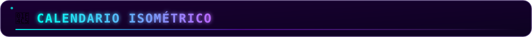
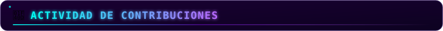

<div align="center">


<a href="https://git.io/typing-svg"></a>


</div>

<br>

<table align="center">
<tr>
<td align="center" width="260">
<br/>
<sub>&#128225; <b>online</b></sub>
</td>
<td>

</td>
</tr>
</table>

<br>



```yaml
role: "Ingeniero Civil en Informática"
focus: "Analista/Desarrollador"
building: "Universidad Católica de Temuco"
learning: ["SpringBoot", "AWS", "Kubernetes"]
looking_to_collaborate: "Desarrollo de software con enfoque en la gestión de procesos"
contact: "efuentealba.git@gmail.com - efuentealba038@gmail.com"
fun_fact: "Jugador de basketball 🏀, Boxeo 🥊 y GYM 💪"
```

<br>


<p align="left">
<a href="https://www.linkedin.com/in/eliacer-fuentealba-5b3003229" target="blank">

</a>
<a href="https://instagram.com/elia_fch" target="blank">

</a>
<a href="mailto:efuentealba.git@gmail.com">

</a>
</p>

<br>


<p align="left">

</p>

<br>


<p align="center">

</p>

<p align="center">

</p>

<br>



<p align="center">

</p>

<br>



<p align="center">


</p>

<div align="center">

</div>
